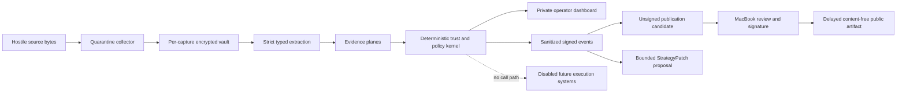
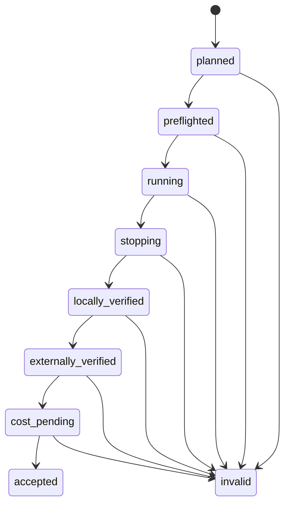

# RSI Observer v1 production-readiness specification

## 1. Purpose, authority, and product boundary

### OBS-GOV-001 — Mission and ownership

RSI means **Recursive Self-Improvement**. Its first production product is a
personal, sole-operator, read-only research system named **RSI Observer**. It is
operated from Arizona, United States. Financial or multi-party ownership remains
unassigned and must be decided before any capital-bearing phase.

### OBS-GOV-002 — Objective ordering

Every design and runtime decision MUST honor this order:

1. immutable safety and policy invariants;
2. survival and bounded operational exposure;
3. provenance, integrity, privacy, and terms compliance;
4. usefulness and, only in a separately authorized future phase, profit;
5. speed.

A lower-ranked benefit never compensates for a higher-ranked violation.

### OBS-GOV-003 — Observer boundary

Observer MAY perform approved, read-only collection from X, OpenSea, Base, and
Robinhood Chain. It MUST NOT hold funds, hold signer material, pay for an API call,
sign or submit a transaction, buy, sell, bid, mint, approve, transfer, post or
engage on X, or represent a hypothetical trade as a real result.

AgentCash, x402, ERC-8004, ERC-8257, ERC-4337, EIP-712 execution intents,
Robinhood Agent, OpenSea write operations, wallets, and trading adapters are
disabled architectural placeholders. The presence of existing execution-oriented
schemas or tests in the repository does not activate them.

### OBS-GOV-004 — Human authority

Only the operator MAY approve watchlist additions, promote a strategy, resume an
incident, sign activation, or authorize publication. There is no delegated resume
authority in v1. Independent kill authority becomes mandatory before paid or
capital-bearing operation.

### OBS-GOV-005 — Fail-closed rule

Ambiguity, incomplete evidence, stale evidence, an unavailable required source,
integrity failure, unexpected cost, retention failure, or policy uncertainty MUST
produce quarantine, abstention, or a stopped state. Observer MUST NOT silently
substitute providers, scrape, broaden scope, or infer permission.

### OBS-GOV-006 — Claims and language

Private and public language MUST be factual and MUST NOT contain buy/sell advice,
profit promises, unsupported accusations, individual X quotes, financial
performance claims, or claims that Observer autonomously learns, rewrites itself,
beats markets, or compounds capital. The approved description is that Observer
“measures its operation, proposes bounded strategy changes, and requires
human-reviewed promotion.”

### OBS-GOV-007 — Review and expiry

This specification MUST receive a formal review every 90 days and immediately
after a material legal, provider, protocol, cost, security, or threat-model change.
Each provider's price, API, terms, retention, finality, authentication, and use
restrictions MUST be revalidated before its first live call, before each release,
and monthly thereafter. Preserve only a signed review record with source locations,
dates, and bounded outcome—not copied provider data. Ambiguity disables the lane;
Observer never works around a restriction. Volatile provider facts MUST also be
revalidated before provisioning. Any move toward financial execution requires a
new design/grilling process regardless of this contract's age.

## 2. Architecture and isolation

### OBS-ARC-001 — One-way trust architecture

External bytes are untrusted data, never instructions. No raw text, HTML, NFT
metadata, media, model prose, provider-generated calldata, tool description, or
discovered manifest may cross into the deterministic trust kernel, publication
artifact, or future executor.

### OBS-ARC-002 — Environments

Observer MUST have three profiles with code-only sharing:

| Profile               | Purpose                                    | Network                 | State and credentials                                                          |
| --------------------- | ------------------------------------------ | ----------------------- | ------------------------------------------------------------------------------ |
| `dev`                 | Synthetic fixtures and offline development | Disabled by default     | No production credentials or state                                             |
| `canary`              | Supervised bounded live qualification      | Explicit allowlist only | Dedicated `rsi-canary` account, Keychain, keys, cursors, database, and vault   |
| `production-observer` | Qualified read-only observation            | Explicit allowlist only | Dedicated `rsi-observer` account, Keychain, keys, cursors, database, and vault |

Canary and production MAY share a signed code release. They MUST NOT share
credentials, mutable state, vault material, cursors, databases, or signing keys.

### OBS-ARC-003 — Host and process model

The Mac mini is the supervised collection node. Production accounts MUST be
standard, non-iCloud macOS accounts. The host MUST use a supported, updated macOS,
FileVault, a block-all/stealth firewall posture compatible with required outbound
allowlists, disabled unnecessary sharing, AirPlay, and remote services, and MUST
prevent sleep only during supervised sessions. A clean post-reboot preflight is
required. Observer MUST run as a non-root user.

Node.js 24 LTS and pnpm 11 MUST be pinned by release evidence. Qualification uses
manual bounded sessions. User-level `launchd` MAY trigger schedules only after
production promotion; it MUST NOT automatically restart a crash.

Exactly one writer MAY own an environment. An exclusive OS lock and startup checks
MUST prevent a second writer. Startup MUST verify the event chain, checkpoint
lineage, cost reservations, clock, deletion state, and incident latch before egress.
A crash latches the profile stopped until local operator review.

### OBS-ARC-004 — MacBook authority

The MacBook is an independent verifier and holds release, operator approval, and
public-artifact signing authority. It verifies externally retained checkpoint
suffixes, backups, releases, publication candidates, and activation evidence. The
Mac mini MUST NOT hold Cloudflare publication or DNS authority.

### OBS-ARC-005 — Network boundary

Normal tests, demos, CI, and package scripts MUST be offline. Live access requires
the canary profile, `--live`, a signed budget reservation, a freshly typed session
identifier, and an exact approved egress target. Redirects are forbidden. There is
no inbound webhook or remote-administration path to the Mac mini.

## 3. Source collection and evidence

### OBS-SRC-001 — X purpose and lanes

The X use declaration is limited to supervised, read-only, private operator
analysis. Observer does not post, engage, profile people, train models, or
redistribute Posts. Qualification runs five lanes:

1. official Base, Robinhood, and OpenSea announcements;
2. approved contract/watchlist references;
3. marketplace and liquidity discussion;
4. security, scam, and manipulation signals;
5. bounded discovery.

The allocation is 80% curated and 20% bounded discovery: 12 curated tickets and
three discovery tickets per qualifying session. Queries are immutable during a
session. The operator approves the curated watchlist and all renewals.

### OBS-SRC-002 — X collection limits

Each X request has exactly `max_results = 10`. Its query is nonempty, contains no
control characters, and is at most 512 characters; an implementation MAY enforce
that limit more conservatively. A ticket allows at most two total attempts; failed,
empty, retried, and pagination attempts consume reservations. Qualification permits
15 tickets per session, at most 150 total, reserving $0.15 per attempt and $22.50
total from a $25 ceiling. Automatic recharge is forbidden.

Before collection starts, ingestion MUST prove that the one-use authorization and
session context agree on attempt ID, operation `x.recent-search.v1`, source plane
`social`, lane, profile, session ID, authorization expiry, and reserved amount
`150000` USD micro-units. The authorization is consumed exactly once immediately
before network dispatch. Missing, expired, underfunded, cross-lane, cross-profile,
cross-session, or differently scoped authorization fails before collection.

The commissioning call is one curated official query, at most ten results, one
attempt, and a $0.15 reservation. It is not qualification session 1. The system
MUST stop and reconcile the provider console immediately afterward.

After burn-in, the normal X schedule is at most one primary call per lane around
08:00, 10:00, 12:00, 14:00, and 16:00 America/Phoenix on weekdays, with no weekend
calls and no more than 150 attempts per billing cycle. Exhaustion disables X
cleanly; it never triggers recharge or a weaker evidence rule.

### OBS-SRC-003 — X cursor and freshness

Per-source `since_id` values MUST be encrypted. A cursor advances only after every
page is encrypted, schema-validated, evented, checkpointed, externally retained,
and independently verified. Until then it remains pending. Cursor values and source
queries MUST NOT enter the permanent event log or backups.

A cursor candidate may be staged only from an attempt already closed as
`succeeded`, with the same profile, source plane, and lane and a staging time not
earlier than attempt close. One consumed network attempt may stage at most one
cursor advance; another page or advance consumes another reservation. Transition
timestamps are monotonic. Retrying initialization, any stage, receipt, or commit
must be exactly content-identical and return that operation's original logical
result even if a later cursor revision exists; conflicting reuse fails closed. A
competing or stale revision never replaces a committed cursor.

Qualification begins with no historical backfill and a five-minute bounded overlap.
Cursor loss starts a new source lineage with bounded overlap, blocks findings until
the overlap closes, and restarts qualification when it occurs during the window.

An X-derived trigger expires at the earliest of 45 minutes, an incomplete lane,
session close, or an observed edit, deletion, identity, or integrity change.

### OBS-SRC-004 — Marketplace and chain sources

OpenSea REST plus Stream form one marketplace evidence plane. Stream events are
provisional triggers until confirmed by REST and finalized canonical chain state.
Alchemy is the required canonical read-only plane for Base and Robinhood Chain.
Public RPC or Blockscout MAY provide a noncritical cross-check but MUST NOT be a
qualification dependency or silent replacement.

Collectors MUST obey a provider's stricter reported expiration and rate-limit
headers inside the fixed local ceilings. A header cannot grant extra calls, extend
retention, or weaken a freshness bound. Exact Robinhood NFT and finality support is
accepted only after canary validation.

The implementation MUST verify provider support and the finalized block tag in
canary. Until revalidated, the planning assumptions are approximately 20 minutes
for Base L1 batch finality and approximately 13 minutes after batch posting for
Robinhood Chain. Unsupported finality makes the lane unavailable.

OpenSea bounds are:

- listing, offer, and order REST acquisition within 60 seconds and expiry at 120
  seconds;
- floor, stats, and trending acquisition within five minutes and expiry at ten
  minutes;
- sales and transfers provisional until finalized onchain;
- Stream as a trigger only, with one reconnect of at most 15 seconds followed by
  REST reconciliation.

Observer MUST NOT retrieve token metadata, token URIs, images, video, audio, HTML,
SVG, IPFS content, or arbitrary web resources.

### OBS-SRC-005 — Request bounds and retries

Only timeout, connection failure, HTTP 408, 429, 502, 503, or 504 may retry.
`Retry-After` MUST be at most 30 seconds. Schema, authentication, authorization,
budget, redaction, and integrity failures never retry.

| Plane              |             Timeout | Maximum response |         Total attempts |
| ------------------ | ------------------: | ---------------: | ---------------------: |
| X                  |          15 seconds |            1 MiB |           2 per ticket |
| OpenSea REST       |          10 seconds |            2 MiB |                      2 |
| OpenSea Stream     | 15-second reconnect |    256 KiB/event | 1 reconnect, then REST |
| Alchemy/public RPC |          10 seconds |            1 MiB |                      2 |
| B2 anchor          |          10 seconds |            4 KiB |           2 idempotent |
| Resend alert       |          10 seconds |            8 KiB |           2 idempotent |

A provider changes the redirect, size, timeout, retry, schema, or origin contract
only through canary and the applicable change gate.

### OBS-EVD-001 — Opportunity and evidence lifecycle

An opportunity moves only through:

`discovered → quarantined → identity_verified → corroborated → insight_eligible → monitored/expired`

There is no buy or execution state. Evidence levels are `discovered`,
`provider_reported`, `corroborated`, and `insight_eligible`; only the final level may
rank as a positive finding.

Positive identity requires exact chain, contract, token scope, and proxy
implementation resolved at the relevant time. The approved positive universe is
secondary ERC-721/1155 activity on Base or Robinhood Chain, capped at 50 contracts
and 25 per chain. Approved entries expire after 30 days unless renewed. At most ten
discovery candidates exist simultaneously, and each expires at session close or 24
hours, whichever comes first.

Ambiguous assets, financial/securities/RWA claims, gambling, stolen/frozen,
sanctioned/restricted, arbitrary-web-dependent, copyright, and impersonation cases
are risk-only. Proxy, ownership, marketplace, restriction, or contract changes
return an asset to quarantine.

### OBS-EVD-002 — Independence and negative asymmetry

OpenSea REST and Stream are one marketplace plane. Alchemy, public RPC, and
Blockscout are one canonical-chain plane. X is one platform plane; multiple authors
count as independent only after stable-origin clustering. An X-surfaced positive
insight requires all three planes and at least three total origin clusters.

One credible hard failure MAY force abstention. Positive evidence MUST NOT use the
same asymmetric rule. Required planes becoming stale, incomplete, or materially
changed immediately expires the finding.

## 4. Data, events, and deletion

### OBS-DAT-001 — Data authority

The normative class, location, retention, backup, model, and publication rules are
defined in [Data classification and retention](./data-classification-retention.md).
Unknown event fields, unknown publication fields, and unclassified source data MUST
fail closed.

### OBS-DAT-002 — Vault v2

Before any live X call, the vault MUST use opaque random capture identifiers,
one data-encryption key per response, an encrypted X identifier index, a local
environment wrapping key, a distinct profile-bound capture-registry key,
idempotent crypto-shredding and deletion, expiry
enforcement, orphan recovery, and content-free events and receipts. The wrapping
key stays in the environment's Keychain and is not backed up; capture keys are
destroyed at purge.

The encrypted session capture registry and Vault commit protocol MUST be
crash-consistent: no complete ciphertext may survive without either an indexed
capture entry or a recoverable deletion intent. Startup and close recovery MUST
find and purge every unindexed or incomplete capture. Retrying the same attempt is
capture-idempotent as well as event-idempotent; it cannot create a second retained
capture behind the original event. Every cleanup path, including registration
failure, produces a content-free deletion receipt without exposing the capture ID
to the permanent event log.

Raw X, OpenSea, Alchemy, and cross-check responses MUST be destroyed at session
close. Qualification has no forensics-retention exception. Investigation preserves
only typed content-free errors and allowed hashes, then reproduces with synthetic
fixtures.

### OBS-DAT-003 — Permanent event allowlist

The durable production event schema MAY contain only versioned random IDs,
environment and bounded enums, timestamps, counts, costs, permitted release/config
and chain-integrity hashes, lane and cursor status without values, exact permitted
onchain/order identifiers, retention/deletion status, checkpoints, signed feedback,
and signed promotion records.

It MUST reject raw X or provider text, X identities or IDs, URLs, queries, provider
origins, response fingerprints/hashes, vault snapshot addresses, credentials,
email addresses, stack traces, model prose, or unknown fields.

### OBS-DAT-004 — Schema and lineage

Canonical signed events are append-only and versioned. They are never rewritten.
Readers understand the previous schema version; derived projections MAY be rebuilt.
A writer switch requires an externally verified checkpoint. An incompatible change
starts a cryptographically linked lineage. Rolled-back software MAY read newer state
but MUST NOT write to it.

### OBS-DAT-005 — Durable epochs and ceilings

Sanitized state is retained for the active project life in signed monthly or
250 MiB epochs. The Mac mini keeps only the active epoch when needed; verified
archives live on the encrypted backup drive and MacBook. Durable state reaching
2 GiB requires maintenance before collection resumes.

At preflight, disk free space MUST be at least 25 GiB and 15%. Collection stops
below 15 GiB or 10%. Encrypted ephemeral capture is capped at 512 MiB per epoch and
1 GiB per day; pending work is capped at 1,000 typed items. Content-free logs rotate
at five 10 MiB files and no more than 30 days. Limits cause abstention and shutdown,
not silent eviction of unverified data.

## 5. Sessions, operator control, and schedules

### OBS-OPS-001 — Supervised session shape

A qualifying session lasts at most 120 minutes. The operator explicitly starts and
closes it and acknowledges at approximately 45 and 90 minutes. A missed
acknowledgment stops and purges the session, which cannot qualify. A session cannot
auto-extend. There is at most one qualifying session per calendar day across ten
distinct days in one 14-day window.

### OBS-OPS-002 — Preflight ceremony

Before egress, the local dashboard MUST show and verify the signed release and
configuration hashes, Node/runtime versions, credential scopes by presence only,
budget reservations, clock, disk, database integrity, backup target, external
anchor, alert path, network allowlist, and disabled financial adapters. The operator
types the generated session identifier to begin.

The clock uses two independent sources. Absolute skew over two seconds warns; over
five seconds aborts. A backward jump or discontinuity greater than two seconds also
aborts.

### OBS-OPS-003 — Session state machine

Crash, reboot, logout, corruption, failed purge, or failed verification before
`accepted` invalidates the session, triggers idempotent purge/orphan cleanup, and
forbids cursor advancement.

### OBS-OPS-004 — Abort and close

Abort MUST immediately block new outbound work, account for in-flight reservations,
preserve pending cursors without committing them, purge ephemeral material,
checkpoint when safe, and lock Keychain access. It MUST work offline and be
idempotent. The local kill action acknowledges within one second and enters
`stopping` within five seconds.

At every batch, the Mac mini writes a unique external checkpoint object while
cursors remain pending. At close, the MacBook verifies the entire externally
retained suffix and signs an operator receipt. Only then may cursors commit. If the
MacBook or anchor is unavailable, the session purges, invalidates, and does not
advance.

### OBS-OPS-005 — Successful session

A qualifying session requires successful preflight; all five X lanes; OpenSea REST
and Stream reconciliation; canonical Alchemy chain closure; content-free digest and
event verification; B2 and MacBook verification; complete purge; backup; alert
health; and zero incident. Optional cross-checks are not qualifying dependencies.

Provider billing may remain `cost_pending` for at most 48 hours. A session is not
accepted or published until reconciled. Missing or above-reserve charges invalidate
the attempt; a later budget correction is an incident.

### OBS-OPS-006 — Continuous production market collection

After activation and burn-in, OpenSea Stream and Alchemy MAY run continuously while
REST and finality checks remain bounded and event-driven. Each UTC day is a separate
epoch verified to B2. Failure pauses collection and cursor advancement. There is no
availability SLA.

### OBS-OPS-007 — Operator dashboard

The dashboard binds to loopback only. It MAY display preflight, session control,
provenance, typed findings, abstentions, close/verify/purge status, feedback, and a
publication-candidate preview. It MAY start, acknowledge, abort, close, label, and
prepare a candidate. It MUST NOT edit policies, queries, budgets, credentials,
events, cursors, or history. Ordinary production operation MUST require no shell.

## 6. Costs and provider accounts

### OBS-COST-001 — Monthly ceiling

The hard recurring ceiling is $50 with no automatic recharge or upgrade:

| Purpose                                                |       Maximum |
| ------------------------------------------------------ | ------------: |
| X                                                      |           $25 |
| Optional post-session OpenAI analysis                  |            $5 |
| GitHub paid plan                                       |            $0 |
| Backblaze B2                                           |            $5 |
| Unallocated reserve                                    |  at least $15 |
| Cloudflare, R2, Resend, Healthchecks, Alchemy, OpenSea | $0 paid usage |

Existing domain renewal and separately approved hardware are outside the recurring
project ceiling. An unexpected charge stops the affected plane. Hardware or paid
resources require a separate visible approval checkpoint.

### OBS-COST-002 — Account control

The operator owns provider accounts and configures MFA/passkeys plus offline
recovery wherever supported. Credential values are entered only through the local
masked provisioning flow described in the permission matrix; values never enter
chat, shell history, `.env`, source control, logs, backups, screenshots, or CI.

## 7. Models and recursive self-improvement

### OBS-RSI-001 — Deterministic qualification

The running qualification system is deterministic. Models MAY analyze sanitized
artifacts only after a session and draft proposals. They MUST NOT influence the
running session, establish trust, determine provenance, decide spending, use tools,
browse, read files, mutate state, or receive hostile/raw provider content.
Qualification remains valid with every model adapter disabled.

If enabled later, the adapter uses a dedicated OpenAI project/service account,
`store: false`, a $5 local preauthorization and provider hard cap, and no expensive
fallback. Provider abuse-log retention is assumed to be up to 30 days; zero-data
retention is not assumed. Luna MAY classify/rank sanitized records; Terra MAY draft
strategy proposals. Model or version drift requires replay. Model-influenced ranking
must first run in shadow mode and pass a separate ten-session supervised evaluation.
The content-free audit record binds requested and returned model IDs, schema version,
usage, cost, and a hash of the parsed sanitized result—not a provider response hash
or model prose. The adapter has no conversation state or background jobs.

### OBS-RSI-002 — Mutable and immutable surfaces

Mutable proposal fields are bounded queries, source allocation inside approved
budgets, typed extraction rules, ranking weights, and retry timing inside existing
limits. Immutable fields include budget ceilings, environment isolation, evidence
rules, allowlists, retention/redaction, human promotion, kill controls, raw/model
separation, and the no-execution boundary. Changing an immutable field requires a
new charter and decision process.

### OBS-RSI-003 — Scorecard and feedback

The deterministic scorecard records leaks/escapes, calibration and precision,
`useful`/`unclear`/`noise`/`misleading` operator labels, cost per useful insight,
freshness, time to verified event, and verified 1-hour/24-hour/7-day subsequent
facts. It MUST NOT invent entry, exit, fill, slippage, gas, bankroll, P&L, return, or
win-rate data. A volatile finding requires signed feedback within 24 hours;
unreviewed findings expire, while aggregate operational metrics may survive.
Feedback MAY include one bounded private note. The note expires with the volatile
finding, never enters a model, permanent event, backup, or public artifact, and
cannot override a safety result. The signed label and bounded aggregate result may
persist.

### OBS-RSI-004 — StrategyPatch lifecycle

At most weekly, Observer MAY produce one active signed declarative `StrategyPatch`.
It expires after 14 days and includes an exact diff, rationale, evidence, visible
and hidden replay results, adversarial results, cost and benefit impact, rollback,
and expiry. It cannot edit source code, production configuration, policies, tests,
logs, credentials, history, or deploy itself. Code-level changes use reviewed PRs.

Evaluation uses visible development fixtures, a rotating hidden corpus, and
chronological production evidence. It requires 100% safety and hidden-adversarial
passage, at least 30 independent labeled decisions against the same baseline, and a
predeclared primary metric whose paired 95% bootstrap confidence interval shows an
improvement. Misleading output cannot worsen; cost, latency, freshness, and
abstention stay within bounds. Sparse or ambiguous results remain experimental.
Promotion is manual; qualifying regressions trigger automatic rollback.

## 8. Alerts, anchors, backup, and recovery

### OBS-REC-001 — Alerts

Resend Free and Healthchecks.io Free are the approved alert planes. Resend uses
`observer@rsi.tylerjb.dev` under a domain-restricted send-only credential, with the
recipient stored locally. A critical alert contains only incident code, severity,
UTC time, profile, session, and an instruction to open the local console.

The local console turns red and affected work stops immediately. Resend handoff
MUST occur within 60 seconds. Healthchecks heartbeats run every five minutes with a
ten-minute grace period. Provider inbox delivery is not a controlled SLA. There is
no inbound Mac webhook. Qualification verifies the path with bounded sent-message
status polling and a content-free canary delivered to Healthchecks.

### OBS-REC-002 — External checkpoints

Private Backblaze B2 Object Lock storage is the independent checkpoint plane.
Checkpoint objects are unique and written after every accepted batch and at session
close. The Mac mini credential is write-only; the MacBook verifier is read-only.
Source data is forbidden. Governance qualification objects retain for 30 days;
after drills, compliance objects retain for 365 days. The MacBook pins and verifies
the complete suffix before acceptance.

### OBS-REC-003 — Backups and recovery

Backups contain sanitized code, SQLite/event state, checkpoint journal, public keys,
versioned configuration schemas, recovery/runbook documentation, and release
evidence only. They exclude raw vaults, encrypted raw indexes, cursors, credentials,
operations-state keys, wrapping keys, and capture keys. An APFS-encrypted external
SSD and the MacBook each receive verified accepted-session state. Per-session
backups retain 30 days; month-end backups retain 365 days.

No accepted session may be lost: acceptance waits for backup and independent
verification. A running session MAY be lost and invalidated. Target restoration is
within 24 hours with no availability shortcut. An isolated restore drill occurs
before qualification and once during the qualification window.

### OBS-REC-004 — Signing keys and releases

The MacBook holds separate release, operator-approval, and public-artifact Ed25519
keys. Each environment holds a separate checkpoint key with two encrypted offline
recovery copies. Every long-lived signing key has two separately stored encrypted
offline recovery copies, annual recovery exercise, and annual or
compromise-triggered rotation through a signed predecessor-to-successor transition.

Provider credentials are replaceable and are not archived. Environment wrapping
keys, per-capture keys, profile-bound capture-registry keys, and separate
operations-state keys are never backed up. An
operations-state key is used only to derive that environment's operations-integrity
and cursor-encryption subkeys; it MUST NOT be reused for vault wrapping or signing.
Its loss or rotation starts a new operations and cursor lineage. A failed key
transition freezes the affected publication or collection plane.

### OBS-REC-005 — Retirement

Permanent shutdown MUST disable scheduling and egress, revoke provider credentials,
destroy wrapping keys and cursors, purge ephemeral data, write a final signed
checkpoint, and archive the public repository read-only. Sanitized governance
records retain only for the approved 365-day period and unavoidable B2 locks, then
are crypto-shredded unless a specific legal requirement applies. Public output is
limited to a signed content-free retired status and correction history.

## 9. Repository, CI, releases, and maintenance

### OBS-REL-001 — Repository and CI

The canonical repository is `/Users/tjb/code/rsi`. The approved remote is the
public `tyler-james-bridges/rsi` repository. Before public disclosure, the tracked
tree and full local Git history receive both repository-owned and independent
secret scans plus the accepted disclosure review. Existing unsigned foundation
commits are retained; a signed `foundation-v1` tag and manifest establish the
reviewed root. The local and remote commit graphs MUST match exactly before
duplicate-repository cleanup proceeds.

CI pins Node 24 and pnpm 11, uses a frozen lockfile and full-commit-SHA actions,
read-only permissions, and no cache, artifacts, secrets, or network-dependent
tests. It checks formatting, TypeScript, tests, dependency audit, demos, Gitleaks,
history, generated files, and dirty state.

Main uses PRs, no force push or deletion, and two required checks. Zero approving
reviews are acceptable only while the operator is the sole contributor; an
independent human becomes mandatory before capital. No GitHub workflow deploys to
the Mac mini.

### OBS-REL-002 — Releases and rollback

A signed release records commit, lockfile, Node/runtime, configuration and policy
hashes, SBOM, test summary, and signing-key identity. The Mac mini receives a
read-only deploy key and installs only a manually approved complete bundle. A
rollback selects the last known-good whole signed bundle with linked lineage; it
never mixes code and dependencies.

Keep the current and previous two Mac-compatible bundles, source tags, manifests,
SBOMs, and verification results on the encrypted drive and MacBook for at least 365
days. Direct dependencies are reviewed weekly; updates never auto-merge or deploy.

Qualification releases require a clean low-severity dependency audit. Secret,
integrity, policy, redaction, retention, signing, and runtime dependency failures
are never waived. Only a verified false positive or dev-only advisory may receive a
signed, nonrenewable seven-day waiver; a runtime advisory cannot enter
qualification.

### OBS-REL-003 — Maintenance and change gates

Planned OS/runtime/dependency maintenance occurs Sunday while X is inactive:
stop, verify checkpoint and backup, patch canary, run the complete offline suite and
supervised smoke session, then sign a release. Critical security updates stop
production until applied and verified. Unattended reboots and package/runtime
upgrades are disabled during operation.

Presentation-only, documentation, and credential-rotation changes MAY use a short
canary when behavior and schemas are provably unchanged. Code, dependency, query,
evidence, policy, retention, budget, provider, or schema changes require canary.
Observable or safety-affecting changes require a fresh ten-session qualification.
Urgency never bypasses a gate.

## 10. Public projection

### OBS-PUB-001 — Separate projection

Public output is a separate repository named `rsi-observer-web`; it contains no
collector, secrets, private events, source content, or exact defensive
configuration. The static Next.js export is hosted on Cloudflare Pages. Signed JSON
artifacts use R2. Planned hostnames are:

- `observer.tylerjb.dev` — static viewer;
- `artifacts.rsi.tylerjb.dev` — signed artifacts;
- `rsi.tylerjb.dev` — Resend domain.

The default `r2.dev` endpoint is disabled and CORS permits only the Observer origin.

### OBS-PUB-002 — Candidate review and delay

The Mac mini writes schema-valid unsigned candidates, at most 16 KiB, to a separate
private B2 review-outbox through a write-only unique-object credential. The MacBook
has read/list/delete authority. Candidates expire after seven days and never share
the checkpoint bucket.

There is no automatic publication. A session must be accepted and at least 24 hours
old; then the MacBook verifies, reviews, signs, and requires explicit publish
approval. The intended cadence is one approved content-free receipt per accepted
session plus one signed weekly operational rollup. Each item independently obeys
the delay, schema, review, signature, and correction rules.

### OBS-PUB-003 — Public receipt schema

Qualification publishes only content-free operational receipts. They MAY contain
schema/version, random ID, dates, environment, release and permitted hashes,
request/lane counts, costs, integrity/deletion/backup/anchor status, aggregate
finding and abstention counts, qualification progress, signature, predecessor,
correction reference, and time.

They MUST NOT identify assets, providers, Posts, accounts, market values, findings,
queries, URLs, or exact defenses. OpenSea or X market data is never public in v1.

### OBS-PUB-004 — Signature and correction

Artifacts use canonical domain-separated Ed25519 bytes. The browser verifies
schema, hash, signature, sequence, predecessor, and correction chain. Any failure
shows only `UNVERIFIED`. The public key fingerprint is independently pinned in DNS
TXT and the operator's public GitHub profile.

Corrections are signed `CorrectionV1` objects. Leakage, legal, or provider-terms
events remove the mutable head, delete the R2 object, purge caches as supported,
publish a tombstone, and open a private incident. Public R2 objects intentionally do
not use retention lock so takedown remains possible.

### OBS-PUB-005 — Site privacy and portfolio

The viewer uses bundled first-party assets only: no analytics, cookies, forms,
accounts, third-party fonts/scripts, ads, pixels, or service worker. It enforces
HTTPS, a strict CSP and security headers, narrow CORS, immutable addressed-artifact
caching, `no-store` for the signed head, visible stale status, and WCAG AA.

The site remains unindexed and unlinked through qualification. After qualification,
seven-day burn-in, and disclosure review, it MAY be linked with this notice:

> Experimental read-only research infrastructure. No trading or financial advice.
> Information may be incomplete, delayed, or stale; verify independently.

Without a signed daily epoch for 24 hours, the viewer MUST mark Observer visibly
stale even if the previous artifact still verifies.

## 11. Readiness and Phase 2 boundary

### OBS-QUAL-001 — Readiness protocol

The normative readiness ladder, qualification equation, reset rules, drills,
activation, and burn-in are defined in
[Readiness and qualification](./qualification-protocol.md). Passing tests does not
mean production is live. Qualification proves read-only operational reliability,
not edge, profit, predictive quality, or advice.

### OBS-PH2-001 — Separate capital system

Observer cannot acquire financial powers through configuration. A live-capital
Phase 2 requires a new threat model, legal/tax review, dedicated wallets/accounts,
capital and drawdown limits, execution simulation, contract review, independent
kill authority, external human security review, and a separate qualification.

Observer MAY emit a one-way signed, expiring `ObservationBundle` containing typed
asset identity, evidence level, origin-cluster count, timestamps, policy reasons,
and release/config hashes. It contains no raw X content, identity, URL, secret,
market order, or spending instruction. A future Robinhood or execution agent MUST
independently refresh order, ownership, chain, recipient, and price state and MUST
NOT treat the bundle as spend authorization or call back to mutate Observer.

## 12. Implementation and evidence

### OBS-BLD-001 — Stage A scope

Stage A covers documentation/traceability, public repository and secret-free CI,
Node 24 pinning, host-preflight tooling, Vault v2, content-free events, cost/cursor
and session state machines, checkpoint/backup interfaces, alerts, dashboard, public
projection, offline adapters, failure-drill harness, and independent adversarial
review. It makes zero live calls and uses zero credentials.

Stage A does not authorize host mutation, DNS, provider resources, credentials,
deployment, paid requests, or live canaries. Those require explicit local approval.

### OBS-BLD-002 — Build order and review

Work lands in this order: contract/traceability; GitHub/CI/runtime; host preflight;
Vault v2; event schema; cost/cursor/crash state; B2; lifecycle/alerts/backup;
dashboard; public projection; offline drills; one-call X commissioning;
OpenSea/chain canaries; integrated typed evidence; qualification. A stage cannot
consume its successor's authority.

Every security-sensitive slice receives independent adversarial review by a
non-authoring agent. Before live access, the repository requires history/secret
scan, dependency audit, exploit suite, backup/restore demonstration, and full
requirement-coverage review.

### OBS-BLD-003 — Deviations and handoffs

If accepted guidance is impossible or stale, the affected branch stops. Evidence,
impact, and the narrowest replacement are presented for explicit approval. Budgets,
providers, credentials, safety rules, or scope are never silently broadened. Internal
details fully within the contract MAY use an ADR.

Every completed stage reports the exact commit and signed release, requirement
coverage, commands/results, independent review, residual risks, money spent,
external changes, rollback, and next required local input.

### OBS-BLD-004 — Duplicate repository cleanup

The verified-empty duplicate `/Users/tjb/Documents/ChatGPT/RSI` may be moved to
Trash only after the public remote and backup are both independently verified. It
MUST NOT be recursively deleted or removed earlier.

### OBS-BLD-005 — Streaming and disclosure

Livestreams use only `dev` with synthetic fixtures and scrubbed demo accounts.
Canary/production screens, terminals, Keychain prompts, provider consoles, queries,
raw responses, logs, DNS, credentials, exact defenses, and live alerts are never
shown. Recordings are reviewed before retention or publication. Source code is
built in public after the accepted disclosure review; public source visibility
never broadens operational-data, hidden-fixture, credential, or runtime authority.
